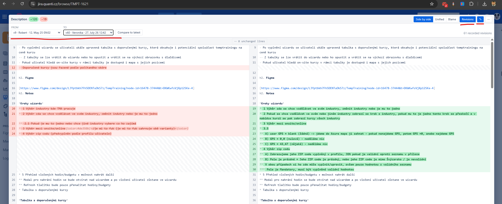
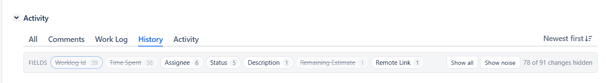
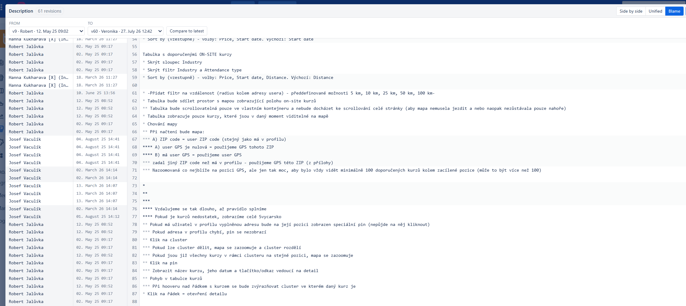
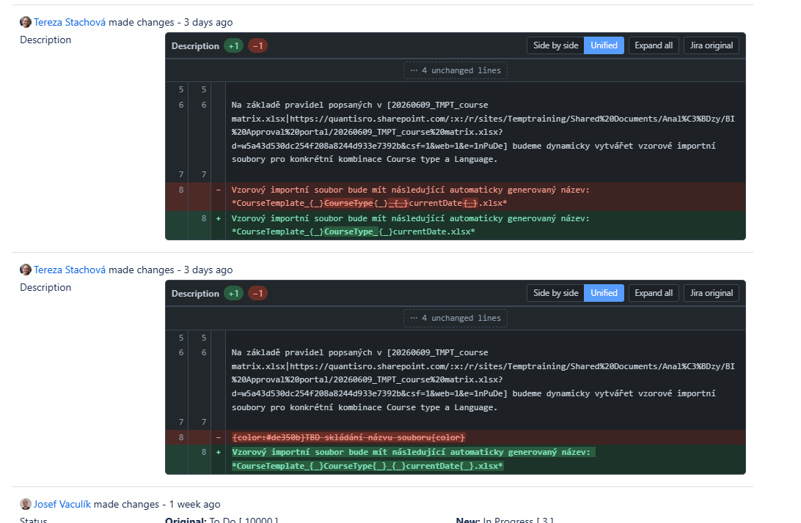
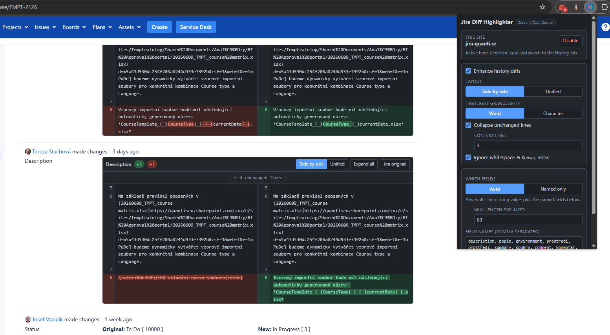

# Jira Diff Highlighter

Rozšíření pro **Chrome i Firefox** (MV3), které na záložce **History** v detailu
tasku nahradí Jiřin plochý výpis „Original / New“ skutečným barevným diffem —
dvousloupcovým nebo sjednoceným, se zvýrazněním na úrovni slov.

Funguje na **on-premise Jiře (Server / Data Center)** i na **Jira Cloud**
(`*.atlassian.net`). Obě platformy mají úplně jiný DOM, ale widget i vzhled jsou
sdílené — liší se jen adaptér, který změnu v DOM najde.



Dvousloupcový diff se zvýrazněním po slovech, sbaleným blokem nezměněných řádků
a otevřeným panelem *Revisions* — porovnání verze `v9` proti `v60` z 61
zaznamenaných revizí popisu.

---

## Co to umí

- **Dvouprůchodový diff** — nejdřív po řádcích (zarovnané páry starý/nový),
  pak uvnitř změněných řádků po slovech. Řádky jsou zarovnané přes CSS grid,
  takže levý a pravý sloupec drží krok i při zalomení dlouhého textu.
- **Dva pohledy** — *Side by side* a *Unified*; přepínač je přímo v liště diffu
  a volba se pamatuje.
- **Skládání beze změny** — dlouhé úseky nezměněných řádků se sbalí na
  `⋯ N unchanged lines` s rozbalením jedním klikem (počet kontextových řádků
  je nastavitelný).
- **Čtení hodnot z Jiry** — odstraní se popisek `Original:` / `New:`,
  interní `<span class="hist-value">[ … ]</span>`, `&nbsp;` výplně
  a zdvojené konce řádků (Jira posílá `<br/>` **i** skutečný newline).
- **Zpět na originál** — tlačítko *Jira original* schová widget a ukáže
  původní buňky Jiry; návrat tlačítkem *↩ Enhanced diff*.
- **Světlý i tmavý motiv** — přepínač *Theme* v popupu: *Auto* / *Light* / *Dark*.
  *Auto* se drží motivu, který si nastavil v samotné Jiře, a teprve když ho Jira
  neuvádí, spadne na motiv OS.
- **Rozumné rozpoznání polí** — v režimu *Auto* se diff použije na každou
  víceřádkovou nebo dostatečně dlouhou hodnotu (Description, Environment,
  Acceptance Criteria, vlastní textová pole…), krátké technické změny
  (Rank, Time Spent, Worklog Id) zůstanou beze změny.
- **Filtr polí** — nad historií se objeví lišta s chipy pro každé pole
  a počtem změn. Kliknutím pole schováš; účetní pole (Rank, Worklog Id,
  Time Spent, Remaining Estimate…) jsou schovaná hned. Skrývá se po řádcích,
  takže on-prem blok zmizí až když v něm nezůstane nic.
- **Timeline revizí** — tlačítko *Revisions* zřetězí všechny změny jednoho pole
  a nechá tě porovnat **libovolné dvě verze**, nejen po sobě jdoucí. Odpoví
  na „co se v popisu změnilo za celý sprint".
- **Blame po řádcích** — třetí pohled vedle *Side by side* / *Unified*. Ke
  každému řádku aktuální hodnoty ukáže, kdo ho zavedl a kdy.
- **Zvýraznění wiki markupu** — ztlumí `h2.`, `{noformat}`, `{{…}}`, `*tučné*`,
  `[odkazy]`, `!obrázky!`. Přepínatelné v nabídce `⋯` u každého diffu.
- **Kopírování** — nová hodnota, stará hodnota, nebo celý diff jako
  standardní unified patch.
- **Zvětšení na celé okno** — tlačítko `⤢` v liště diffu. Zavírá se `Esc`
  nebo klikem mimo. Widget zůstává plně funkční (blame, revize, kopírování).
- **Samostatná stránka** — `⋯ → Open in a new tab`. Diff se otevře na vlastní
  stránce rozšíření, nezávisle na Jira tabu; hodí se na blame a timeline
  na velkém monitoru.

### Jak to vypadá

**Filtr polí** nad historií. Čísla jsou počty změn daného pole; přeškrtnuté
chipy jsou vypnuté. Tady je z 91 změn skrytých 78 — všechno účetní šum
(Worklog Id, Time Spent, Remaining Estimate), takže zůstane vidět jediná
změna popisu, kvůli které tam člověk šel.



**Blame po řádcích.** Ke každému řádku aktuální hodnoty jméno a datum revize,
která ho zavedla — sestavené zřetězením všech 61 zaznamenaných změn popisu.



**Sjednocený pohled** v tmavém motivu, přímo v proudu historie. Dvě po sobě
jdoucí editace jednoho popisu, každá se svým vlastním widgetem.



---

## Instalace

Rozšíření se nepublikuje, načítá se lokálně. Kořen repa je rovnou načtitelný
v Chrome; pro Firefox (a pro balíčky k distribuci) se buildí:

```bash
npm run build          # -> dist/chrome/ a dist/firefox/
npm run build:zip      # + dist/chrome-1.2.0.zip, dist/firefox-1.2.0.zip
```

### Chrome / Edge

1. Otevři `chrome://extensions`.
2. Zapni **Developer mode**.
3. **Load unpacked** → vyber kořen repa (nebo `dist/chrome/`).
4. Otevři svoji Jiru, klikni na ikonu rozšíření a v popupu dej **Enable**.

### Firefox

1. `npm run build`
2. Otevři `about:debugging#/runtime/this-firefox`.
3. **Load Temporary Add-on…** → vyber `dist/firefox/manifest.json`.
4. Stejně jako výše: ikona rozšíření → **Enable**.

Dočasný add-on zmizí při restartu prohlížeče. Pro trvalou instalaci potřebuješ
podepsaný XPI z [addons.mozilla.org](https://addons.mozilla.org/developers/)
(nahraj `dist/firefox-1.2.0.zip`, klidně jako *unlisted* — dostaneš podepsaný
XPI jen pro sebe), nebo Firefox Developer Edition / ESR s
`xpinstall.signatures.required=false` v `about:config`.

Než budeš publikovat, přepiš `GECKO_ID` v [tools/build.js](tools/build.js) na
vlastní — je to identita add-onu na AMO.

### Proč se musí ještě klikat na Enable

On-premise Jira běží na libovolném interním hostname, takže v manifestu není
žádná pevná `matches` doména. Popup si vyžádá oprávnění pro konkrétní origin
a teprve pak zaregistruje content script (`scripting.registerContentScripts`,
`persistAcrossSessions`). Aktuálně otevřená záložka se doinjektuje hned, další
načtení už jedou samy.

Odebrání přístupu k hostu: stejný popup → **Disable** (zruší registraci
i samotné oprávnění).

---

## Nastavení (popup)



Karta **This site** nahoře je to, čím se rozšíření na daném hostu zapíná
(viz [Instalace](#instalace)); pod ní jsou volby z tabulky níž.

| Volba | Výchozí | Popis |
|---|---|---|
| Enhance history diffs | zapnuto | Hlavní vypínač. |
| Jira flavour | Auto-detect | Který adaptér běží. *Auto* rozhoduje podle hostname; přepni ručně, pokud máš Cloud za vlastní doménou nebo on-prem na `atlassian.*`. |
| Layout | Side by side | Dvousloupcový vs. sjednocený pohled. |
| Theme | Auto | *Auto* = podle Jiry, jinak podle OS. *Light* / *Dark* vynutí barvy bez ohledu na obojí. |
| Highlight granularity | Word | Zvýraznění po slovech nebo po znacích. |
| Collapse unchanged lines | zapnuto | Sbalování nezměněných úseků. |
| Context lines | 3 | Kolik nezměněných řádků zůstane kolem změny. |
| Ignore whitespace & `&nbsp;` noise | zapnuto | Sjednotí odsazení a sloučí prázdné řádky. |
| Highlight wiki markup | zapnuto | Výchozí stav zvýraznění; přepínatelné i u každého diffu v nabídce `⋯`. |
| Field filter above the history | zapnuto | Lišta s chipy nad historií. |
| Hide bookkeeping fields by default | zapnuto | Účetní pole schová hned po načtení. |
| Bookkeeping fields | rank, worklog id, time spent, … | Co se považuje za šum; porovnává se jako podřetězec. |
| Which fields | Auto | *Auto* = víceřádkové/dlouhé hodnoty + jmenovaná pole, *Named only* = jen jmenovaná pole. |
| Min. length for auto | 80 | Práh délky pro režim *Auto*. |
| Field names | description, popis, environment, … | Seznam se porovnává jako podřetězec, takže funguje i na lokalizované názvy. |

Nastavení je ve `storage.sync` a projeví se okamžitě ve všech otevřených
záložkách.

---

## Struktura

```
manifest.json          MV3 pro Chrome; Firefox varianta se z něj odvozuje
background.js          registrace/odregistrace content scriptů podle oprávnění
common/settings.js     sdílené defaulty + storage vrstva (popup i content)
common/theme.js        rozhodnutí světlý/tmavý (nastavení > Jira > OS)
content/
  diff.js              Myers O(ND) + patience anchory, word/char tokenizer
  extract.js           DOM -> čistý text (labely, hist-value, <br/>, &nbsp;, seznamy)
  markup.js            tokenizer Jira wiki markupu (round-trip garantovaný)
  history.js           řetěz revizí, detekce mezer, blame
  render.js            model řádků, sbalování, CSS grid, lišta widgetu, blame
  adapters.js          hledání změn: Server/DC tabulka + Cloud struktura
  filter.js            lišta filtru polí nad historií
  expand.js            overlay na celé okno
  content.js           orchestrace, MutationObserver, přepínání, diagnostika
  styles.css           vzhled widgetu (světlý/tmavý)
popup/                 popup UI
viewer/                samostatná stránka s diffem (stejný renderer)
docs/                  screenshoty pro README (nejde do buildu)
tools/
  build.js             dist/chrome + dist/firefox (+ --zip), bez závislostí
  make-icons.js        generátor ikon
  serve.js             statický server pro offline fixture
test/
  fixture.html         reálná on-prem HTML struktura pro ruční kontrolu
  fixture-cloud.html   odvozená Cloud struktura pro ruční kontrolu
  diff.test.mjs        unit testy diff enginu
  background.test.mjs  background proti falešným API obou prohlížečů
  adapters.test.mjs    routing platforem + parsování Cloud labelu
```

### Jak se rozhoduje motiv

Veškeré tmavé styly visí na `html[data-jdh-theme="dark"]`, **nikde není
`prefers-color-scheme`**. Ten atribut nastavuje [common/theme.js](common/theme.js)
a je to jediné místo, kde se rozhoduje. Přednost:

1. **Nastavení** *Light* / *Dark* — vynutí barvu, na nic dalšího se nekouká.
2. **Jira** — v režimu *Auto* se čte `data-color-mode` na `<html>`. Přijme se
   jen doslovné `light`/`dark`; když tam Jira má vlastní „match browser",
   znamená to, že se sama odkládá, takže se odloží i rozšíření.
3. **OS** — `prefers-color-scheme`.

Proč Jira bije OS: Jira má vlastní přepínač motivu, a když se s OS rozejdou,
widget řízený jen OS svítí bíle uprostřed tmavé stránky. Změna motivu Jiry
za běhu se sleduje `MutationObserver`em (`data-jdh-theme` schválně **není**
v jeho `attributeFilter`, aby si zápis nespouštěl sám sebe).

> Přesný název atributu Jiry je odvozený z Atlassian design tokens a proti živé
> instanci ověřený není. Kdyby *Auto* motiv Jiry nechytalo, funguje to jako
> dřív podle OS a pomůže ruční *Light* / *Dark*.

### Zvětšení a samostatná stránka

**Overlay** widget fyzicky přesune do `<body>`, ne že mu jen dá
`position: fixed`. Cloud DOM je plný předků s `transform` a `contain`, což
z fixed elementu udělá jen absolutně pozicovaný — přesun z toho podstromu
problém obejde místo hádání, který předek za to může. Původní místo drží
placeholder, takže se widget vrátí přesně tam, odkud přišel. Rescan během
zvětšení nic neosiří: `teardown()` nejdřív zavolá `widget.destroy()`.

**Samostatná stránka** dostane payload přes `storage.session`, ne zprávou do
nového tabu — ten při vytvoření ještě neposlouchá a MV3 background může být
kdykoli uspán, takže držet to v proměnné by o data přišlo. Řetěz revizí obsahuje
DOM referencí, které přes hranici zprávy neprojdou, proto jde přes
`JDHHistory.toPayload()`. Drží se posledních 10 hand-offů (aby fungovalo
načtení stránky znovu) a payload nad 4 MB se odmítne, ať se nepřeteče kvóta.

Stránka používá **stejný renderer** — nic Jira-specifického se do ní nedostane.

### Řetěz revizí a proč hlásí neúplnost

Jeden záznam historie říká jen „z tohoto se stalo tohle". Timeline i blame ale
potřebují celou posloupnost hodnot, takže se záznamy jednoho pole zřetězí.
Řetěz je důvěryhodný jen když na sebe navazují: `záznam[i].newText` se musí
rovnat `záznam[i+1].oldText`.

Když se nerovnají, něco chybí — Cloud starší položky dolazuje až při scrollování,
a Jira, která by v historii zkracovala dlouhé hodnoty, by se rozbila stejně.
Takové zlomy se **evidují jako mezery**, ne zamlčí: v panelu *Revisions* se
objeví varování a blame se označí za nedůvěryhodný. Radši přiznaná neúplnost
než tiše špatná atribuce.

Dvě věci z toho plynou:

- **Výchozí pohled je vždy ta změna, kterou Jira u dané položky zaznamenala**,
  nikdy `chain[i-1] → chain[i]`. Přes mezeru by to jinak ukázalo změnu, kterou
  nikdo neudělal.
- **Pořadí se nepředpokládá.** Jira umí activity feed řadit od nejnovějšího
  i od nejstaršího, takže se zkusí oba směry a vybere ten, který navazuje.

### Jak se najde změna na každé platformě

**Server / Data Center** — přesný selektor, markup je stabilní od Jiry 7.x:

```
table#changehistory_<id>
  tr > td.activity-name + td.activity-old-val + td.activity-new-val
```

**Cloud** — generovaný React DOM. Všechny prezentační třídy jsou hashované
(`_19pku2gc`), takže na ně nejde sáhnout; `data-testid` ale sémantické jsou:

```
div[data-testid="history.feed-container"]
  ul > li
    div[data-testid="issue-history.ui.history-items.<druh>-history-item.history-item"]
      div[data-vc="profilecard-wrapper"]     avatar autora
      div                                    obsahový sloupec
        div > div                            hlavička:
          div > [profilecard-wrapper]          jméno autora
          "updated the "                       spojovací text
          span                                 NÁZEV POLE
        div                                  časové razítko
        div                                  ← dvojice, právě 3 potomci:
          div  stará hodnota
          div  (prázdný — šipka je v CSS)
          div  nová hodnota
```

Adaptér nejdřív zúží hledání přes `data-testid`, pak dvojici **potvrdí podle
tvaru** (3 potomci, prostřední bez textu). Tvarová kontrola je pojistka pro
případ, že Atlassian testid přejmenuje. Název pole se čte jako poslední listový
`<span>` hlavičky — funguje to i na custom pole (`RemoteWorkItemLink`) a
v jakémkoli jazyce, bez seznamu klíčových slov.

Rozdíl je i ve čtení textu: Server posílá `<br/>` **a** skutečný newline (takže
newline v textu se musí ignorovat), zatímco Cloud předává plain-text blob, kde
skutečné newliny jsou jediné zalomení. Řeší to přepínač `textNewlines`
v `extract.js`.

### Když to na Cloudu nefunguje

Content scripty běží v izolovaném světě, takže **`JDHContent` z konzole stránky
nevidíš** — `JDHContent.diagnose()` tam skončí na `ReferenceError`. Použij
místo toho tlačítko **Diagnose** v popupu: zkopíruje report do schránky
(a vypíše ho do konzole popupu — otevřeš ji pravým tlačítkem na popupu →
*Inspect*).

Report obsahuje detekovanou platformu, počet nalezených history items a pro
každou z nich přečtený název pole, jestli se našla dvojice a co s ní filtr
polí udělal.

Alternativně jde v DevTools přepnout kontext konzole (rozbalovátko vedle
*top*) na *Jira Diff Highlighter* — tam `JDHContent.diagnose()` funguje.

### Proč vlastní diff engine

Upstream používá `diff-match-patch`, což je znakový diff nad celým textem.
U víceřádkových popisů z toho vzniká „konfety" efekt. Tady je diff nejdřív
řádkový (aby šly řádky zarovnat vedle sebe jako na GitHubu) a teprve uvnitř
párovaných řádků slovní. Když je řádek přepsaný od základu
(> 72 % změněných znaků), zvýrazní se celý místo rozsekání na útržky.

Pro velké vstupy se Myers vypne a použijí se *patience* kotvy (unikátní
společné řádky) s rekurzivním dělením; v nejhorším případě diff degraduje na
„smazáno vše / vloženo vše" místo zamrznutí stránky.

---

## Vývoj

```bash
npm test
```

Vizuální kontrola bez Jiry — fixture obsahuje přesnou on-prem HTML strukturu
(popis, summary, environment, dlouhý popis se sbalováním, i řádky, které se
zvýrazňovat nemají):

```bash
node tools/serve.js
```

pak otevři `http://localhost:4173/test/fixture.html` (on-prem) nebo
`http://localhost:4173/test/fixture-cloud.html` (Cloud). Fixtury načítají stejné
skripty jako rozšíření; `chrome.*` API se automaticky obchází (`JDH_TEST_SETTINGS`).

Obě fixtury jsou doslovné kopie reálného HTML (on-prem Jira Server, resp.
Jira Cloud z `*.atlassian.net`) včetně hashovaných tříd — ty tam jsou schválně,
aby bylo vidět, že na nich adaptér nestojí.

Cloud fixture se navíc **kontroluje sama**: dole vypíše zelený `SELF-CHECK
PASSED` nebo červený seznam toho, co nesedí. Když Atlassian markup změní, stačí
do fixtury vložit nový výřez History tabu a rozdíly se ukážou tam.

Přegenerování ikon:

```bash
node tools/make-icons.js
```

### Jak funguje cross-browser build

Kořenový `manifest.json` je zároveň Chrome manifest i zdroj pravdy. Firefox
verzi z něj [tools/build.js](tools/build.js) odvodí patchem, takže obě nemůžou
rozejít:

| | Chrome | Firefox |
|---|---|---|
| background | `service_worker` | `scripts` (event page — MV3 service worker v Gecku není) |
| identita | — | `browser_specific_settings.gecko.id` (nutné pro `storage.sync`) |
| minimální verze | — | `strict_min_version: 128.0` |

**Pozor na jmenné prostory** — jediná netriviální nekompatibilita v kódu:

- Chrome MV3 vrací promisy z `chrome.*`.
- Firefox promisifikuje **jen** `browser.*`; jeho `chrome.*` je callback-only
  kompatibilní alias a promisy nevrací.

Proto:

- **promise-based kód** (`background.js`) musí sáhnout po
  `globalThis.browser || globalThis.chrome`,
- **callback-based kód** (`common/settings.js`, `content/content.js`,
  `popup/popup.js`) musí zůstat u `chrome.*`, protože `browser.*` by ty
  callbacky nikdy nezavolalo.

Míchat se to nesmí. `test/background.test.mjs` pouští `background.js` proti
falešným API obou prohlížečů (Firefox varianta má navíc `chrome` návnadu, která
vrací `undefined`), takže návrat k holému `chrome.` v promise kódu testy shodí.

---

## Inspirace

Nápad a UX vychází z [richiehowelll/jira-diff](https://github.com/richiehowelll/jira-diff)
(GPL-3.0), který řeší totéž pro Jira Cloud. **Není to doslovný fork** — on-prem
DOM je úplně jiný, takže extrakce, diff engine i rendering jsou napsané od
nuly a žádný upstream kód se sem nepřenášel. Pokud chceš mít projekt
formálně navázaný na upstream, změň licenci na GPL-3.0.

## Licence

MIT — viz [LICENSE](LICENSE).
